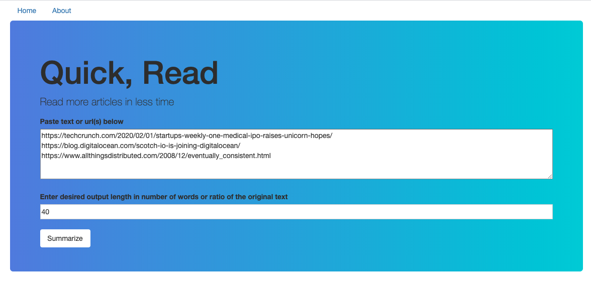

# A Flask Web App for summarizing readings

_Quick, read_ is an app for summarizing readings

Accepted formats include text and HTML
Summerizes using extractive or abstractive methods (WIP)

## Demo




## Usage

Sample input for articles

1. Raw text, or
2. A list of webpages, including those with .txt endings. pdf, ppt and non-textual pages are currently not supported.

Sample setting for desired output length

1. Number of words (e.g. 50) each article will be summarized in, or
2. Ratio of summarization (e.g. 0.2)

## Set up

To run it locally, git clone this repo, cd into the folder, set up a virtual environment

```
virtualenv --python python3 venv
source venv/bin/activate
```

And install dependencies

```
make install
```

Running the app locally

```
export FLASK_APP=run.py
export FLASK_DEBUG=1
flask run
```

## Tools

Flask, Flask-WTF, BeautifulSoup, Gensim, Transformers, Bootstrap and Google CloudBuild for continuous deployment

## Web app

[Demo app](https://flask-quick-read.herokuapp.com)
TODO: pre-load T5 models and tokenziers to save loading time

## License

MIT
