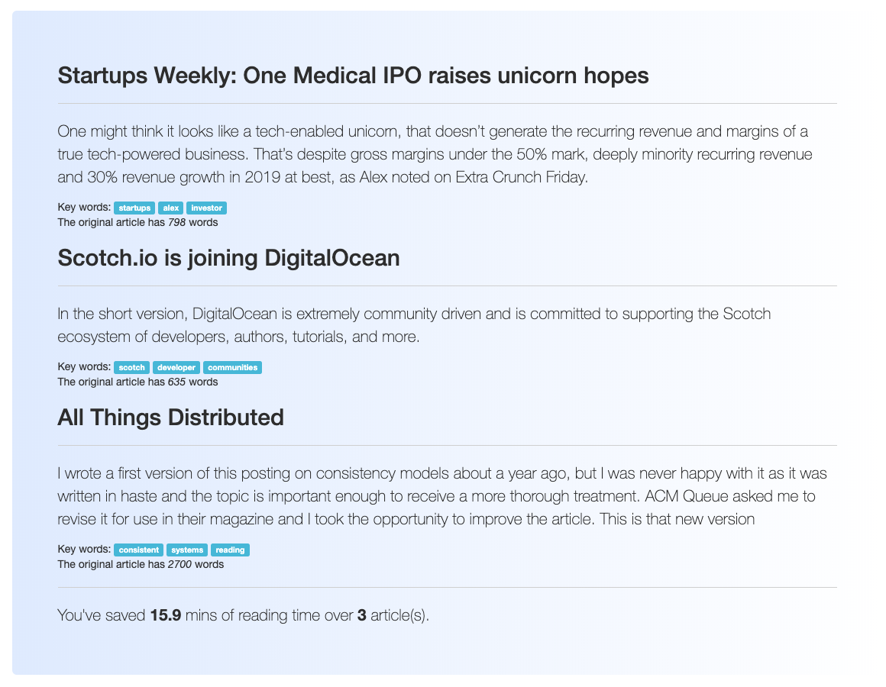

# A Flask Web App for summarize readings

_Quick, read_ is an app for summarize readings and potentially generate writeups (under development)

Accepted formats include text and html

## Demo




[Demo App](https://flask-266401.appspot.com/)

## Set up

To run it locally, git clone this repo, cd into the folder, set up virtual environment

```
virtualenv --python python3 venv
source venv/bin/activate
```

And install dependencies

```
make install
```

Running the app locally

```
export FLASK_APP=run.py
export FLASK_DEBUG=1
flask run
```

## Tools

Flask, Flask-WTF, BeautifulSoup, Gensim and Google CloudBuild for continuous deployment

## License

MIT
